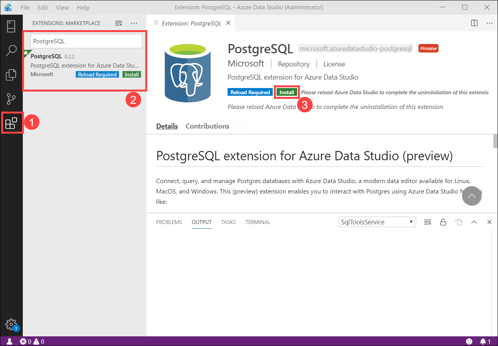
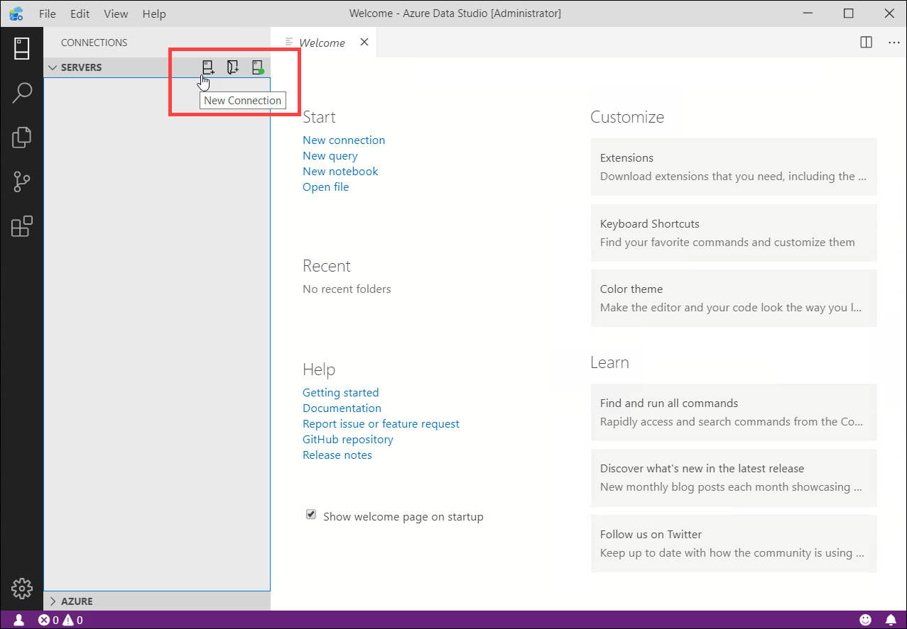

## **Lab 2: Connecting to Hyperscale (Citus) on Azure Database for PostgreSQL**

Here we will start wroking with Azure Data Studio by connecting our database to it.

### Task 1: Connect to the database using Psql in Azure Data Studio

Now we will connect to PostgreSQL Database through Azure Data Studio.

1. Open **Azure Data Studio** provided on the dektop. On the left click on **Extension** icon, then in the search bar enter **PostgreSQL** and select **Install**. After this you may need to restart the Azure Data Studio.

2. Now select **New Connection** button to establish connection with the postgreSQL database.

3.  Use following configurations for **Connection Details**:
- Connection type: select **PostgreSQL** from the dropdown
- Server Name: **srvxxxxx.postgres.database.azure.com** (go to Azure Portal, navigate to RG **citusxxxx** and locate Azure Database for PostgreSQL server v2 - PREVIEW **srvxxxx**,open it and on the top right corner locate the server name)
- Username: **citus**
- Passwword: **Password123**
- Database Name: **citus**
- Server Group: For server group name, select **Add server group** from the dropdown and enter your server group name i.e., **postgresxxxxx** (go to Azure Portal, navigate to RG **citusxxxx** and locate **postgresxxxxx**) as shown below:

4. **Connection details** should look similar to the below, then select **Connect**:

5. After getting connected, you can find your **PostgreSQL Database** under **Server** pane as shown below:

6. Click **Next** on the bottom right of this page.
