# Building-Real-time-applications-using-Hyperscale-Citus


## Overview
Hyperscale (Citus) has the ability to parallelize your queries across multiple workers/resources to give immense performance improvements. One workload that can benefit from this ability of parallelism is powering real-time dashboards of event data.
For example, you could be a cloud services provider helping other businesses monitor their HTTP traffic. Every time one of your clients receives an HTTP request your service receives a log record. You want to ingest all those records and create an HTTP operational analytics dashboard which gives your clients insights such as the number of HTTP errors their sites served. It’s important that this data shows up with as little latency as possible so your clients can fix problems with their sites. It’s also important for the dashboard to show graphs of historical trends.

Alternatively, maybe you’re building an advertising network and want to show clients click rates on their campaigns. In this example latency is also critical, raw data volume is also high, and both historical and live data are important.
For this experience we will instruct you on how to deal with a number of real-time and scaling issues using Hyperscale (Citus) on Azure Database for PostgreSQL. 

## Exercise 1: Getting Started
This exercise will help you getting access to environment and getting started within it. 

### Task 1: Sign Up for pre configured environment

1.	Navigate to bitly link which was provided by instructor and register by providing all required information and clicking on **SUBMIT** button.<br/>


2. Once registration is accepted, you will be automatically redirected to the lab activation page. Click on the **Launch Lab** button.<br/>


3. You will see the environment details soon below.<br/>


4. Please ensure to use provided Azure Credentials during the course of Lab. 


### Task 2: Log into your Azure Portal and Verify access to the Lab

In this exercise, you will log into the **Azure Portal** using your Azure credentials. 

1. Login to **LabVM** by clicking on **GO TO LabVM** button on lab details page. 


2. Open Azure Portal by launching shortcut from the desktop.


3. Enter the **Username** which was displayed in the previous window and click on **Next**.<br/>


4. Enter the **Password** and click on **Sign in**.<br/>


5. In the Welcome to **Microsoft Azure** pop-up window, click **Maybe Later**. Now you have login successfully.


6. You will see one Resource Group on which you have access. 
7. Click on **rg-XXXXX** Resource Group which contains the pre-deployed Azure SQL Database for PostgreSQL.


## Exercise 2: Getting started with Hyperscale (Citus)

For a successfule connection into Hyperscale (Citus) on Azure Database for PostgreSQL, we need to 

### Task 1: Configure server-level firewall service

Follow the instructions given below to allow yourself access to the Hyperscale (Citus) server group.
 
1. Navigate to **Azure Portal**.

2. In the upper left of the Azure Portal go to **Home**, theb locate **Azure services** and select **Azure Database for PostgreSQL servers** on homepage.


2. Click on your PostgreSQL Database **postgreXXXXX**


3. On the left side navigation of the overview pane under **Security** click **Networking**. Put **Allow Azure Service** to **YES** and **save** the changes.


## Exercise 3: Connecting to Hyperscale (Citus) on Azure Database for PostgreSQL

Here we will start wroking with Azure Data Studio by connecting our database to it.

### Task 1: Connect to the database using Psql in Azure Data Studio

Now we will connect to PostgreSQL Database through Azure Data Studio.

1. Open **Azure Data Studio**, select **New Connection** button to establish connection with the postgreSQL database.


2.  Use following configurations for **Connection Details**:
* Connection type: select **PostgreSQL** from the dropdown
* Server Name: **srvxxxxx.postgres.database.azure.com** (go to Azure Database for PostgreSQL server v2 - PREVIEW **srvxxxx**, on the       top right corner locate the server name)
* Username: **citus**
* Passwword: **Password@123**
* Database Name: **citus**
* Server Group: For server group name, select **Add server group** from the dropdown and enter your server group name i.e., **postgrexxxxx** as shown below:


3. **Connection detials** should look similar to the below, then select **Connect**:


4. After getting connected, you can find your **PostgreSQL Database** under **Server** pane as shown below:


### Task 2: Create Application Tables

The data we’re dealing with is an immutable stream of log data that we will be inserting directly into Hyperscale (Citus). It’s also common for log data to first be routed through something like Kafka. Kafka has many benefits like allowing you to pre-aggregate the data so high volumes of data are manageable.
On this page we will create a simple schema for ingesting HTTP event data, shard it, create load and then query.
Let's create the tables for http requests, per-minute aggregates and a table that maintains the position of our last rollup.

1. Expand the server group **postgresxxxxx**, then the server and under server expand **Database**. Right click on the database **citus** and select **New Query**.


2.In the console copy and paste the following to create the tables.

```
-- this is run on the coordinator
CREATE TABLE http_request (
site_id INT,
ingest_time TIMESTAMPTZ DEFAULT now(),
url TEXT,
request_country TEXT,
ip_address TEXT,
status_code INT,
response_time_msec INT
);
CREATE TABLE http_request_1min (
site_id INT,
ingest_time TIMESTAMPTZ, -- which minute this row represents
error_count INT,
success_count INT,
request_count INT,
average_response_time_msec INT,
CHECK (request_count = error_count + success_count),
CHECK (ingest_time = date_trunc('minute', ingest_time))
);
CREATE INDEX http_request_1min_idx ON http_request_1min (site_id, ingest_time);
CREATE TABLE latest_rollup (
minute timestamptz PRIMARY KEY,
CHECK (minute = date_trunc('minute', minute))
);
```


3. On running the query a message will be displayed: **Commands completed successfully**.


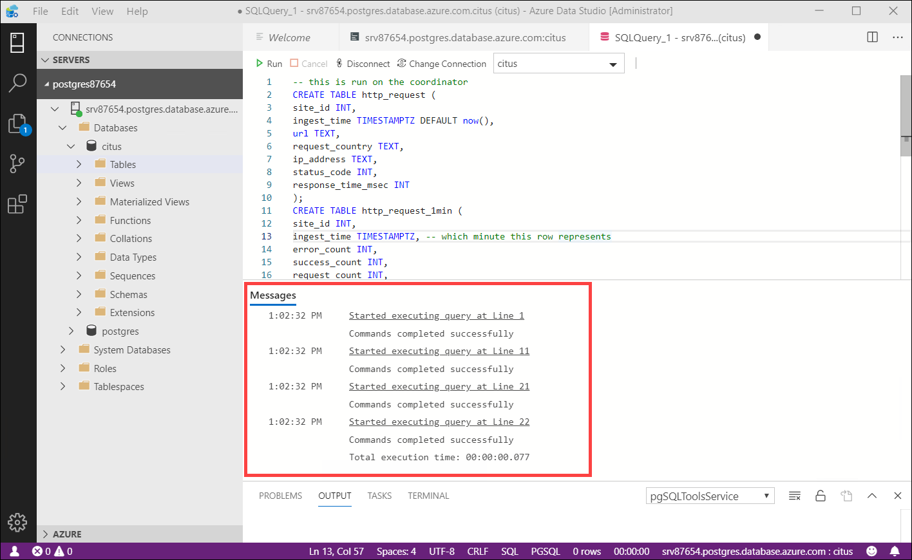


4. Verify the tables created by going to **Databases** > **citus** > **Tables**, under **Tables** you can review the tables. 


**Shard tables across nodes**

A hyperscale deployment stores table rows on different nodes based on the value of a user-designated column. This "distribution column" marks how data is sharded across nodes. Let's set the distribution column to be site_id, the shard key.

4. Now  select **New Query** as done before. Then copy and paste the following in the console to see what you just created. 

```
SELECT create_distributed_table('http_request', 'site_id'); 
SELECT create_distributed_table('http_request_1min', 'site_id'); 
```


The above commands create shards for both the tables across worker nodes. Shards are nothing but PostgreSQL tables that hold a set of sites. All the data for a particular site for a table will live in the same shard.
Notice that both tables are sharded on site_id. Hence there’s a 1-to-1 correspondence between http_request shards and http_request_1min shards i.e shards of both tables holding same set of sites are on same worker nodes. This is called colocation. Colocation makes queries, such as joins, faster and our rollups possible. In the following image you will see an example of colocation where for both tables site_id 1 and 3 are on worker 1 while site_id 2 and 4 are on Worker 2.


**Generate data**
The system is ready to accept data and serve queries now! The next set of instructions will keep the following loop running in a Psql console in the background while you continue with the other commands in this article. It generates fake data every second or two.
 
5. In the Cloud Shell Psql console copy and paste the following to exit to the bash console. 

```
\q 
```

6. On the Cloud Shell banner click the **editor icon**.


7. In the Cloud Shell editor copy and paste (use Contorl+V key to paste in the editor) the following to create the http_request load generator

```
-- loop continuously writing records every 1/4 second
DO $$
BEGIN LOOP
    INSERT INTO http_request (
    site_id, ingest_time, url, request_country,
    ip_address, status_code, response_time_msec
    ) VALUES (
    trunc(random()*32), clock_timestamp(),
    concat('http://example.com/', md5(random()::text)),
    ('{China,India,USA,Indonesia}'::text[])[ceil(random()*4)],
    concat(
        trunc(random()*250 + 2), '.',
        trunc(random()*250 + 2), '.',
        trunc(random()*250 + 2), '.',
        trunc(random()*250 + 2)
    )::inet,
    ('{200,404}'::int[])[ceil(random()*2)],
    5+trunc(random()*150)
    );
    COMMIT;
    PERFORM pg_sleep(random() * 0.25);
END LOOP;
END $$;
```


8. On the top right of the Cloud Shell editor click the **ellipse** and choose **Close Editor**.
9. Click Save on the "Do you want to save" dialog 


10. Enter the name **load.sql** for the file name and click **Save**.


11. In the Cloud Shell bash console copy and paste the following then press enter to run **load.sql** in the background. 

```
psql "host=srvxxxxx.postgres.database.azure.com port=5432 dbname=citus user=citus password='Password@123' sslmode=require" -f load.sql &
```


**Dashboard query**
The Hyperscale (Citus) hosting option allows multiple nodes to process queries in parallel for speed. For instance, the database calculates aggregates like SUM and COUNT on worker nodes, and combines the results into a final answer.

12. In the Cloud Shell bash console copy and paste the following then press enter to launch Psql again 

```
psql "host=srvxxxxx.postgres.database.azure.com port=5432 dbname=citus user=citus password='sp*4ytajvr2y4fa4' sslmode=require"
```

13. Open **New Query** console and enter the following command to verify the real-time load is being generated.

```
Select Count(*) from http_request; 
```

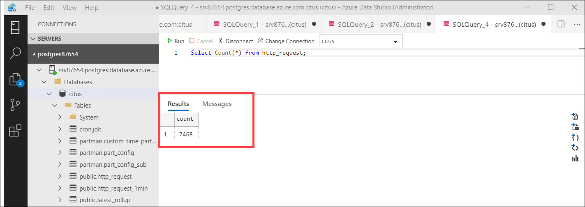

14. In the Cloud Shell Psql console enter the select command once more to see that the count is increasing. You will observe increase in the count.

```
Select Count(*) from http_request; 
```


 
15. We will run this query to count web requests per minute along with a few statistics. For this open **New Query** console, then paste the following to see average response time for sites.

```
SELECT
site_id,
date_trunc('minute', ingest_time) as minute,
COUNT(1) AS request_count,
SUM(CASE WHEN (status_code between 200 and 299) THEN 1 ELSE 0 END) as success_count,
SUM(CASE WHEN (status_code between 200 and 299) THEN 0 ELSE 1 END) as error_count,
SUM(response_time_msec) / COUNT(1) AS average_response_time_msec
FROM http_request
WHERE date_trunc('minute', ingest_time) > now() - '5 minutes'::interval
GROUP BY site_id, minute
ORDER BY minute ASC
LIMIT 15;
```


**Rollups**

As your data scales we want to keep performance up. We will ensure our dashboard stays fast by regularly rolling up the raw data into an aggregate table. You can experiment with the aggregation duration. Here we will use a per-minute aggregation table, but you could break data into 5, 15, or 60 minutes instead.

1. Open a **New Query** console and paste the following to create the rollup_http_request function.

```
-- initialize to a time long ago
INSERT INTO latest_rollup VALUES ('10-10-1901');

-- function to do the rollup
CREATE OR REPLACE FUNCTION rollup_http_request() RETURNS void AS $$
DECLARE
curr_rollup_time timestamptz := date_trunc('minute', now());
last_rollup_time timestamptz := minute from latest_rollup;
BEGIN
INSERT INTO http_request_1min (
    site_id, ingest_time, request_count,
    success_count, error_count, average_response_time_msec
) SELECT
    site_id,
    date_trunc('minute', ingest_time),
    COUNT(1) as request_count,
    SUM(CASE WHEN (status_code between 200 and 299) THEN 1 ELSE 0 END) as success_count,
    SUM(CASE WHEN (status_code between 200 and 299) THEN 0 ELSE 1 END) as error_count,
    SUM(response_time_msec) / COUNT(1) AS average_response_time_msec
FROM http_request
-- roll up only data new since last_rollup_time
WHERE date_trunc('minute', ingest_time) <@
        tstzrange(last_rollup_time, curr_rollup_time, '(]')
GROUP BY 1, 2;

-- update the value in latest_rollup so that next time we run the
-- rollup it will operate on data newer than curr_rollup_time
UPDATE latest_rollup SET minute = curr_rollup_time;
END;
$$ LANGUAGE plpgsql;
```

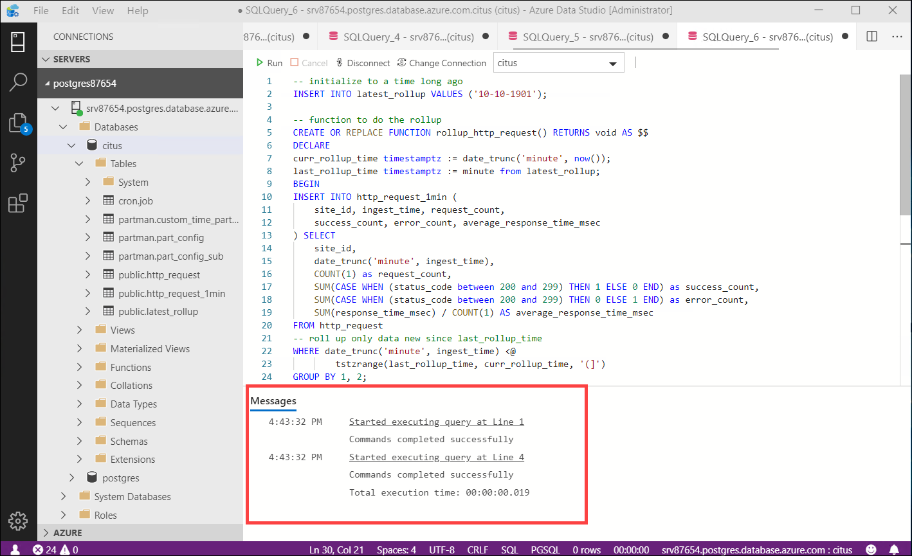


2. In the Psql console copy and paste the following to execute the rollup function 
```
SELECT rollup_http_request(); 
```

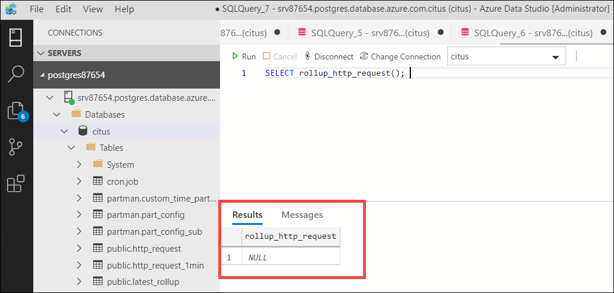

Note: The above function should be called every minute. You could do this by using a PostgreSQL extension called pg_cron which allows you to schedule recurring queries directly from the database. 

3. Here the above rollup function can be called once every minute by the below command. Replace the above command with the following:

```
SELECT cron.schedule('* * * * *','SELECT rollup_http_request();'); 
```

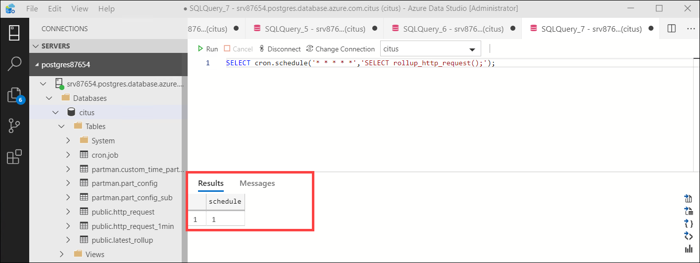


4. Open a **New Query** console and paste the following to run the query on the 1 minute aggregated table.

```
SELECT site_id, ingest_time as minute, request_count,
    success_count, error_count, average_response_time_msec
FROM http_request_1min
WHERE ingest_time > date_trunc('minute', now()) - '5 minutes'::interval
LIMIT 15;
```

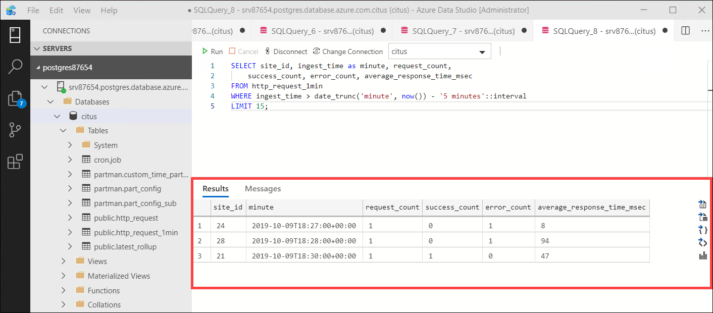

***Expiring Old Data
The rollups make queries faster, but we still need to expire old data to avoid unbounded storage costs. Simply decide how long you’d like to keep data for each granularity, and use standard queries to delete expired data. In the following example, we decided to keep raw data for one day, and per-minute aggregations for one month. You don't need to run these commands right now as we don't have any old data to expire.***

```
DELETE FROM http_request WHERE ingest_time < now() - interval '1 day';
DELETE FROM http_request_1min WHERE ingest_time < now() - interval '1 month';
``` 

***In production you could wrap these queries in a function and call it every minute in a cron job.
Data expiration can go even faster by using latest time partitioning feature in PostgreSQL in addition to sharding with Hyperscale (Citus). You could also use extensions like pg_partman to automate time partition creation and maintenance.
Those are the basics! We provided an architecture that ingests HTTP events and then rolls up these events into their pre-aggregated form. This way, you can both store raw events and also power your analytical dashboards with subsecond queries.
The next sections extend upon the basic architecture and show you how to resolve questions which often appear.***

## Exercise 4: Approximate Distinct Counts

A common question in HTTP operational analytics deals with approximate distinct counts: How many unique visitors visited your site over the last month? Answering this question exactly requires storing the list of all previously-seen visitors in the rollup tables, a prohibitively large amount of data. However an approximate answer is much more manageable.

A datatype called hyperloglog, or HLL, can answer the query approximately; it takes a surprisingly small amount of space to tell you approximately how many unique elements are in a set. Its accuracy can be adjusted. Without HLLs this query involves shipping lists of IP addresses from the workers to the coordinator for it to deduplicate. By using HLLs you can greatly improve query speed.

For non-Hyperscale (Citus) installs you much first you must install the HLL extension and enable it. You would run the Psql command CREATE EXTENSION hll; on all nodes in this case. This is not necessary on Azure as Hyperscale (Citus) already comes with HLL installed, along with other useful Extensions.
Now we’re ready to track IP addresses in our rollup with HLL. First add a column to the rollup table.

###Task 1: Track IP addresses in Rollup

 1. Open a **New Query** console and paste the following:

```
ALTER TABLE http_request_1min ADD COLUMN distinct_ip_addresses hll; 
```


 
2. Next we will use our custom aggregation to populate the column. Open a **New Query** console and paste the following to add it to the query of our rollup function.

```
-- function to do the rollup
CREATE OR REPLACE FUNCTION rollup_http_request() RETURNS void AS $$
DECLARE
curr_rollup_time timestamptz := date_trunc('minute', now());
last_rollup_time timestamptz := minute from latest_rollup;
BEGIN
INSERT INTO http_request_1min (
    site_id, ingest_time, request_count,
    success_count, error_count, average_response_time_msec,
    distinct_ip_addresses
) SELECT
    site_id,
    date_trunc('minute', ingest_time),
    COUNT(1) as request_count,
    SUM(CASE WHEN (status_code between 200 and 299) THEN 1 ELSE 0 END) as success_count,
    SUM(CASE WHEN (status_code between 200 and 299) THEN 0 ELSE 1 END) as error_count,
    SUM(response_time_msec) / COUNT(1) AS average_response_time_msec,
    hll_add_agg(hll_hash_text(ip_address)) AS distinct_ip_addresses
FROM http_request
-- roll up only data new since last_rollup_time
WHERE date_trunc('minute', ingest_time) <@
        tstzrange(last_rollup_time, curr_rollup_time, '(]')
GROUP BY 1, 2;

-- update the value in latest_rollup so that next time we run the
-- rollup it will operate on data newer than curr_rollup_time
UPDATE latest_rollup SET minute = curr_rollup_time;
END;
$$ LANGUAGE plpgsql;
```

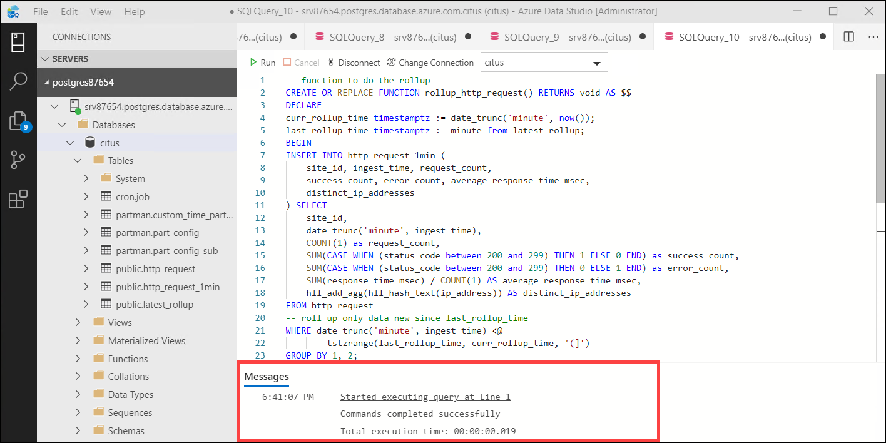

3.	Then open a **New Query** console and paste the following to execute the updated function.

```
SELECT rollup_http_request(); 
```

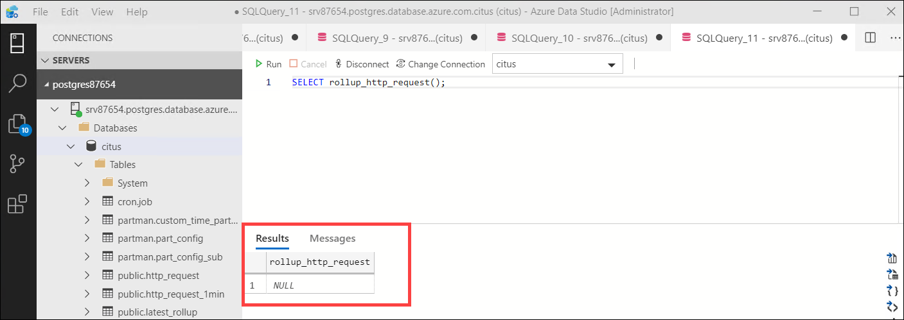

 
4. Dashboard queries are a little more complicated, you have to read out the distinct number of IP addresses by calling the hll_cardinality function.

5. For this open a **New Query** console and paste the following to create a report using the hll_cardinality function 

```
SELECT site_id, ingest_time as minute, request_count, 
    success_count, error_count, average_response_time_msec, 
    hll_cardinality(distinct_ip_addresses)::bigint AS distinct_ip_address_count 
FROM http_request_1min 
WHERE ingest_time > date_trunc('minute', now()) - interval '5 minutes' 
LIMIT 15;
```

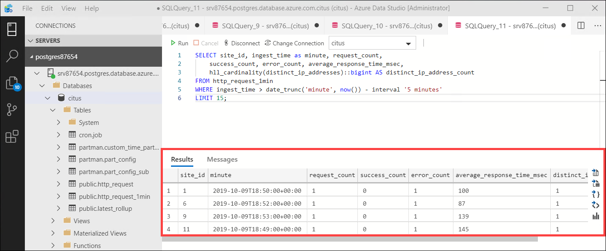

HLLs aren’t just faster, they let you do things you couldn’t previously. Say we did our rollups, but instead of using HLLs we saved the exact unique counts. This works fine, but you can’t answer queries such as “how many distinct sessions were there during this one-week period in the past we’ve thrown away the raw data for?”.
With HLLs, this is easy. You can compute distinct IP counts over a time period with the following query
 
5. open a **New Query** console and paste the following to compute distinct IP counts over time.

```
SELECT hll_cardinality(hll_union_agg(distinct_ip_addresses))::bigint
FROM http_request_1min
WHERE ingest_time > date_trunc('minute', now()) - '5 minutes'::interval
LIMIT 15;
```

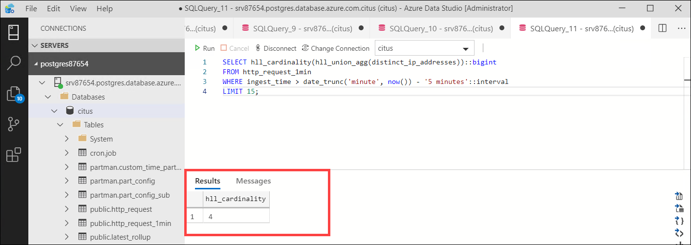

## Task 2: Unstructured Data with JSONB

Hyperscale (Citus) works well with Postgres’ built-in support for unstructured data types. To demonstrate this, let’s keep track of the number of visitors which came from each country. Using a semi-structure data type saves you from needing to add a column for every individual country and ending up with rows that have hundreds of sparsely filled columns. 

PostgreSQL has JSONB and JSON data types for storing JSON data. The recommended data type is JSONB because a) indexing capabilities (GIN and GIST) of JSONB compared to JSON and b) JSONB provides compression because of binary format. Here we’ll demonstrate how to incorporate JSONB columns into your data model.
 
1. Open a **New Query** console and paste the following to add a new JSONB column to our rollup table 

```
ALTER TABLE http_request_1min ADD COLUMN country_counters JSONB; 
```

2. Now open a **New Query** console and paste the following to update the rollup_http_request function with country_counters 

```
-- function to do the rollup
CREATE OR REPLACE FUNCTION rollup_http_request() RETURNS void AS $$
DECLARE
curr_rollup_time timestamptz := date_trunc('minute', now());
last_rollup_time timestamptz := minute from latest_rollup;
BEGIN
INSERT INTO http_request_1min (
    site_id, ingest_time, request_count,
    success_count, error_count, average_response_time_msec,
    distinct_ip_addresses,
    country_counters
) SELECT
    site_id,
    date_trunc('minute', ingest_time),
    COUNT(1) as request_count,
    SUM(CASE WHEN (status_code between 200 and 299) THEN 1 ELSE 0 END) as success_count,
    SUM(CASE WHEN (status_code between 200 and 299) THEN 0 ELSE 1 END) as error_count,
    SUM(response_time_msec) / COUNT(1) AS average_response_time_msec,
    hll_add_agg(hll_hash_text(ip_address)) AS distinct_ip_addresses,
    jsonb_object_agg(request_country, country_count) AS country_counters
FROM (
    SELECT *,
        count(1) OVER (
        PARTITION BY site_id, date_trunc('minute', ingest_time), request_country
        ) AS country_count
    FROM http_request
    ) h
-- roll up only data new since last_rollup_time
WHERE date_trunc('minute', ingest_time) <@
        tstzrange(last_rollup_time, curr_rollup_time, '(]')
GROUP BY 1, 2;

-- update the value in latest_rollup so that next time we run the
-- rollup it will operate on data newer than curr_rollup_time
UPDATE latest_rollup SET minute = curr_rollup_time;
END;
$$ LANGUAGE plpgsql;
```


3. In the **New Query** console enter the following to execute the updated function .

```
SELECT rollup_http_request(); 
```


Now, if you want to get the number of requests which came from America in your dashboard, your can modify the dashboard query to look like this.
 
4. Then replace the above with the following to see the requests from America.
.
```
SELECT
request_count, success_count, error_count, average_response_time_msec,
COALESCE(country_counters->>'USA', '0')::int AS american_visitors
FROM http_request_1min
WHERE ingest_time > date_trunc('minute', now()) - '5 minutes'::interval
LIMIT 15;
```

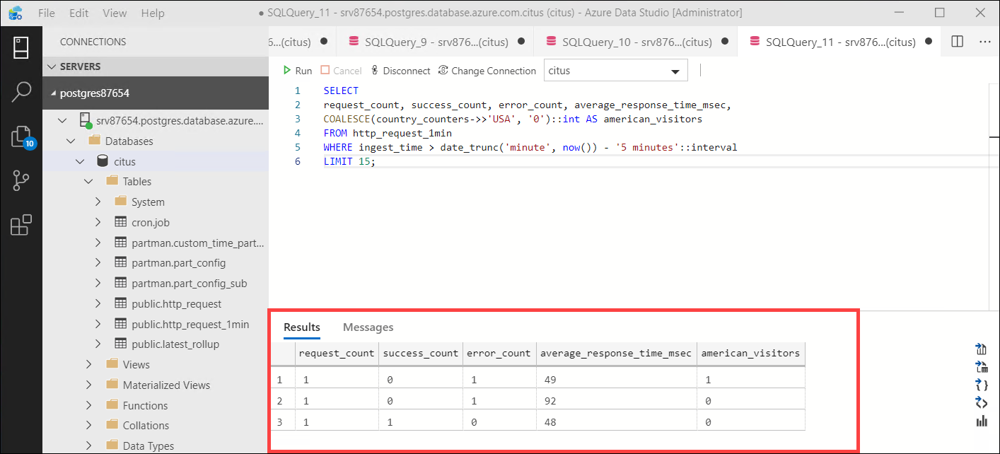
